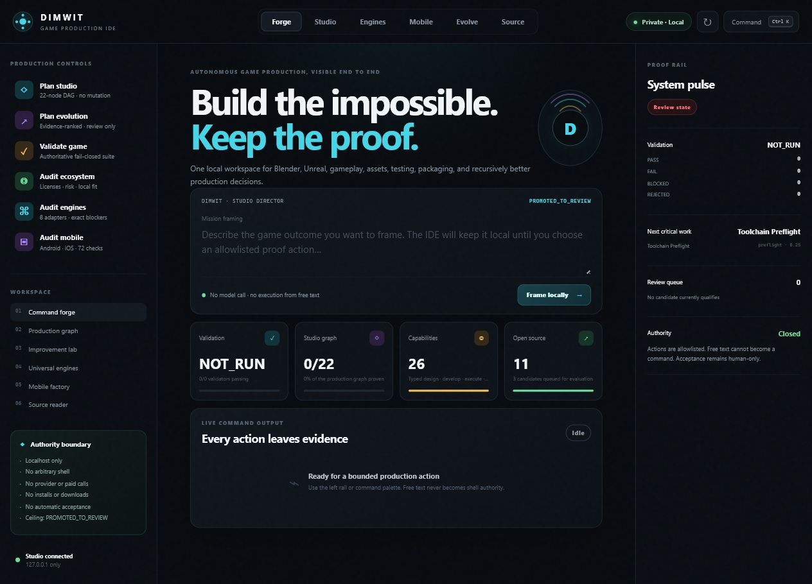
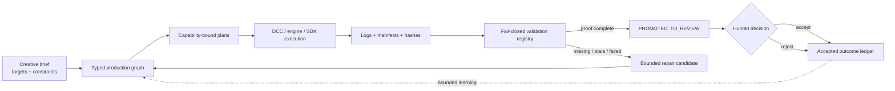
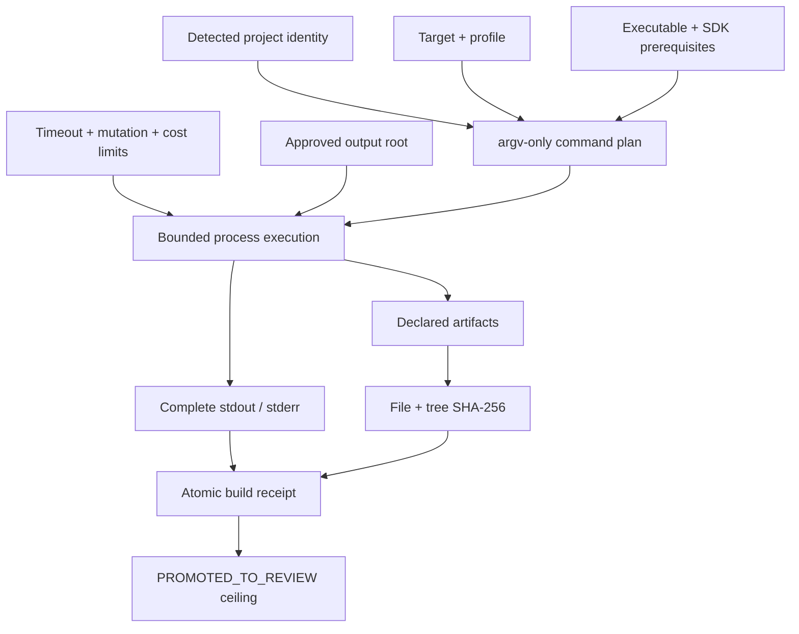
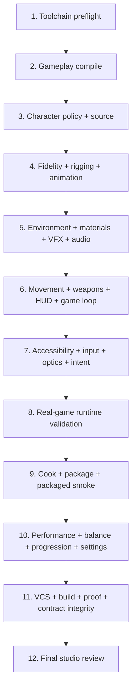
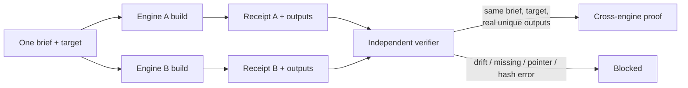

# Dimwit

<div align="center">

**A proof-bearing production studio for games, worlds, characters, and builds.**

One brief. Many toolchains. A resumable production graph.<br>
Every executable lane returns receipts. Every promotion stops for human review.

[](https://github.com/ObtuseAI/dimwit/actions/workflows/tests.yml)
[](https://www.python.org/)
[](.github/workflows/tests.yml)
[](AGENTS.md)
[](docs/DIMWIT_DUMBMONEY_MARKET_CELL.md)
[](LICENSE)

</div>



Dimwit is a local-first production control system that coordinates game development across source code, Unreal Engine, Blender, neural 3D tools, web and native engines, mobile SDKs, validation harnesses, and human review.

It turns a brief into a typed, dependency-aware production graph. Each runnable step is bound to a known capability, explicit prerequisites, confined outputs, budgets, logs, and content hashes. Missing engines, stale captures, malformed receipts, failed visual review, or absent project evidence remain visible blockers.

Dimwit can autonomously prepare a candidate up to `PROMOTED_TO_REVIEW`. Human acceptance, source integration, signing, publishing, payment, account access, store submission, and active-slice promotion remain operator-owned.

The evidence machinery is not specific to art. A second system consumes it: [`dimwit/market/`](dimwit/market) is the technical-analysis and chart-vision cell of [DumbMoney](#second-consumer-the-dumbmoney-market-cell), where the same law applies to prices — 46 indicators proven prefix-stable by recomputation, chart recovery error reported in pixels, and rule survival reported only after a disclosed search and a placebo. It emits observations and never a forecast.

## Product truth

| Contract | Current public state |
| --- | --- |
| **Portfolio role** | **Multi-DCC Production Evidence Plane** — evidence-native orchestration across Unreal, Blender, native engines, mobile toolchains, validation, and review. |
| **Maturity** | **Research preview** |
| **Engineering evidence baseline** | [`1019e4df`](https://github.com/ObtuseAI/dimwit/commit/1019e4dfb6191a2e751829253fde7359c5bb2d67) · configured [test workflow](https://github.com/ObtuseAI/dimwit/actions/workflows/tests.yml) |
| **Proved now** | The public source implements typed production graphs, capability detection, bounded command plans, receipts, artifact hashing, fail-closed validators, recovery candidates, and review promotion. |
| **Authority ceiling** | Automation stops at `PROMOTED_TO_REVIEW`. Human operators own acceptance, integration, publishing, accounts, payment, signing, and active-slice promotion. |
| **Second runtime consumer** | **DumbMoney market cell** — [`dimwit/market/`](dimwit/market) implements the assigned role `chart_vision_and_deterministic_technical_analysis_for_stocks_and_crypto`: deterministic TA, chart render and chart *vision*, walk-forward rule evidence, sports game state. Observations only; no network, no credentials, no broker. |
| **Clean demonstration** | Use the [quick start](#quick-start) to inspect the graph, run provider-free checks, and exercise bounded studio surfaces. |
| **Known limit** | DCC execution, live captures, visual judgment, mobile SDKs, and packaged-build proof depend on the actual local toolchains and current project evidence; missing evidence remains blocked. |

**Designed for:** studios and technical production teams that need AI-assisted creative throughput with receipts, replay, rollback, and a hard human review ceiling.

[Explore the ObtuseAI portfolio](https://github.com/ObtuseAI) ·
[Inspect the production contract](#a-shared-contract-for-very-different-engines) ·
[Start a technical conversation](https://github.com/ObtuseAI/dimwit/issues)

## Dimwit in one minute

| Question | Answer |
| --- | --- |
| **What is it?** | A multi-DCC game-production orchestrator, evidence registry, local Studio IDE, and recursive improvement system. |
| **What can it coordinate?** | Gameplay code, characters, rigging, animation, environments, materials, VFX, audio, UI, input, builds, packages, captures, performance, progression, and store-readiness plans. |
| **Which toolchains does it understand?** | Unreal, Blender, Unity, Godot, Defold, Bevy, web engines, CMake/native, Flutter/Flame, Android, iOS planning, and audited neural 3D paths. |
| **Does every engine execute everywhere?** | No. Adapters report detected, ready, plan-only, blocked, or reference-only based on actual project and toolchain evidence. |
| **What is the core output?** | A review candidate with build receipts, logs, artifact hashes, validator results, provenance, rollback notes, and unresolved blockers. |
| **What makes it different?** | It treats creative-production claims as evidence contracts rather than accepting successful process exit, generated files, or AI confidence as proof. |
| **Does anything else use it?** | Yes. [`dimwit/market/`](dimwit/market) is DumbMoney's technical-analysis and chart-vision cell — same evidence law, applied to prices and game state instead of pixels and packages. `python -m dimwit market audit --deep` runs it and reports what actually executed. |

## The production problem

Modern game production is not one pipeline. A character may cross image generation, neural reconstruction, Blender repair, retopology, UVs, baking, rigging, animation, Unreal import, material setup, runtime capture, visual judgment, packaging, and performance validation.

Each application has different automation semantics, exit-code behavior, artifact formats, credentials, licensing constraints, and failure modes. A file existing on disk does not prove:

- it came from the intended source;
- it was built for the intended target;
- the application actually loaded it;
- the output is current;
- the mesh deforms correctly;
- the runtime used the expected character or material;
- the packaged game contains the result;
- the result looks good;
- a human approved it.

Dimwit supplies a shared production language across those boundaries.



The system can iterate on evidence. It cannot promote itself past review.

## From brief to review

Consider a production objective:

> Build an Android-ready arena prototype with one rigged hero, responsive input, a readable HUD, a packaged smoke test, and current evidence for frame pacing and settings persistence.

Dimwit decomposes that request into verifiable stages:

| Stage | Production work | Evidence expected |
| --- | --- | --- |
| **1. Intent** | Normalize the game, target, platform, mode, quality, asset, and authority requirements. | Versioned brief and target identity. |
| **2. Capability audit** | Detect the project, engine, SDKs, DCCs, adapters, source state, and prerequisites. | Capability matrix with exact ready and blocked reasons. |
| **3. Production graph** | Build an acyclic DAG for code, content, import, runtime, package, performance, and review. | Validated dependencies, costs, budgets, and proof paths. |
| **4. Plan** | Produce argv-only tool plans with confined outputs and timeouts. | Serialized command, executable identity, inputs, and output root. |
| **5. Execute** | Run only when mutation is explicitly enabled. | Complete stdout/stderr, start/end state, process result, and atomic receipt. |
| **6. Verify** | Re-hash outputs, inspect engine state, run tests, captures, and domain validators. | Artifact tree hashes, contract checks, screenshots, telemetry, and verdicts. |
| **7. Repair** | Rank a bounded repair candidate from the observed failure. | New-information rationale, expected value, cost, risk, and prior outcome references. |
| **8. Promote** | Require current proof across every blocking domain. | `PROMOTED_TO_REVIEW`, never accepted or published. |
| **9. Decide** | Present evidence and unresolved risk to the operator. | Human accepted/rejected outcome record. |

If Android SDK evidence is absent, the mobile lane blocks. If Unreal returns zero but does not write the required result JSON, the job fails. If a screenshot is stale or bound to the wrong process, it does not satisfy visual proof. If the build passes but the required settings state does not survive restart, final promotion remains blocked.

## A shared contract for very different engines

Every executable adapter speaks the same core contract:



This does not make every tool interchangeable. It makes their claims comparable.

## Engine and platform atlas

| Adapter | Project evidence | Planned target surface | Honest behavior |
| --- | --- | --- | --- |
| **Unreal Engine** | `.uproject`, engine discovery, UBT/UAT/Editor paths | Windows, Android; build, commandlet, cook, stage, pak, archive, package | Executes only with the configured Epic toolchain; result files and output trees are independently verified. |
| **Unity** | `Assets/` and `ProjectSettings/ProjectVersion.txt` | Desktop, WebGL, Android, iOS, server, XR | Produces a stable plan and reports the Editor as blocked when absent. |
| **Godot** | `project.godot` and export preset | Desktop, web, Android, iOS, server | Requires official headless export tooling and declared presets. |
| **Defold** | `game.project` and `bob.jar` | Desktop, HTML5, Android, iOS | Blocks when Bob is unavailable. |
| **Bevy** | `Cargo.toml` containing Bevy | Desktop, web, server | Uses the Rust/Cargo toolchain through the shared receipt contract. |
| **Web games** | `package.json` naming a supported web engine | Web and wrapped mobile plans | Recognizes Phaser, PlayCanvas, Babylon, Three, Pixi, and MelonJS families. |
| **CMake/native** | `CMakeLists.txt` | Desktop, Android, server, XR | Plans configuration and builds under a confined output root. |
| **Flutter/Flame** | `pubspec.yaml` containing Flame | Desktop, web, Android, iOS | Reports Flutter/Xcode requirements rather than fabricating readiness. |
| **Reference-only detection** | GameMaker, CryEngine, O3DE, or Construct project markers | Inventory only | Cannot execute until a reviewed adapter implements the engine contract. |

The matrix answers “what adapter exists?” separately from “what is installed here?” and “what has been proved for this project?”

## Capability atlas

### 1. Production graph and scheduler

The studio scheduler coordinates an acyclic, resumable production DAG.

Each node declares:

- unique task and pipeline identity;
- dependencies and critical path;
- capability and executable requirements;
- read and write surfaces;
- expected artifacts and validators;
- retry, breaker, timeout, and cost budgets;
- receipt and proof locations;
- rollback or repair notes;
- maximum promotion state.

Completed nodes whose required proof disappears revert to `PROOF_MISSING`. A resumed run does not trust a green status that has lost its underlying artifact.

### 2. The 22-node studio path

The source-controlled studio configuration spans the complete game-production path:



The numbered groups summarize 22 configured nodes, not twelve opaque mega-tasks. The graph remains inspectable at node level and supports bounded execution by ready node count and cost.

### 3. Blender production lane

Repository-owned Blender jobs use:

- executable discovery with an explicit override;
- reviewed script allowlisting;
- `--factory-startup`;
- disabled auto-execution;
- argv-only subprocess invocation with `shell=False`;
- approved output-root confinement;
- timeouts and complete logs;
- atomic results and manifests;
- script SHA-256 plus file and output-tree SHA-256;
- plan-only behavior until mutation is explicitly enabled.

Blender surfaces cover primitive blockout, mesh repair, topology analysis, retopology, UV-preserving map rebake, bake workflows, decimation for skinning, mannequin rigging, anatomy review, and FBX-scale probes.

A `.blend` or `.fbx` file is an output, not the final proof. Downstream import, skeleton compatibility, deformation, runtime utilization, visual quality, and package inclusion have their own gates.

### 4. Unreal production lane

The Unreal adapter discovers the project, engine, Editor, UnrealBuildTool, and AutomationTool. It can plan:

- Editor commandlets;
- repository-confined Unreal Python automation;
- C++ Editor and game-target builds;
- cook, stage, pak, archive, and BuildCookRun packaging;
- authenticated loopback editor inspection;
- process-bound runtime capture;
- packaged smoke and output-tree verification.

It calls Epic’s `Build.bat` and `RunUAT.bat` entry points so the engine’s bundled .NET environment is established.

Unreal automation has two important truth rules:

1. A process exit code is not enough when the job contract requires a result file.
2. A capture is not valid unless it is bound to the expected process, time window, and configured capture root.

### 5. Neural 3D and supply-chain control

Dimwit integrates neural reconstruction without silently modifying upstream repositories.

- InstantMesh and TripoSR live as pinned submodules.
- Dimwit adaptations live in [`third_party/patches/`](third_party/patches/) and [`neural3d_extensions/`](neural3d_extensions/).
- Patch application is explicit and reviewable.
- Model and tool availability are capability facts, not implied dependencies.
- Inputs, outputs, scripts, revisions, and hashes remain part of provenance.
- Missing weights, GPU capacity, licenses, or upstream code block the relevant lane.

Generated geometry still enters the same repair, topology, rigging, import, runtime, optics, and review chain as any other asset.

### 6. Character and animation production

The character path is not “generate a mesh and import it.” It includes:

- source and roster identity;
- multiview and symmetry evidence;
- anatomy and topology review;
- high-to-low geometry and bake records;
- skeleton and mannequin compatibility;
- bounded skin influences and deformation checks;
- rig-deform identity;
- animation-roster and utilization evidence;
- runtime process and subject identity;
- semantic optics quorum;
- packaged gameplay-motion proof.

This is designed to catch a common failure: a technically valid asset exists, but the game is still using the wrong, stale, or visibly broken character.

### 7. Universal mobile factory

The mobile factory models twelve evidence lanes:

1. touch and gestures;
2. adaptive layout, safe areas, orientation, tablets, foldables, and notches;
3. startup, backgrounding, resume, interruption, process death, and save/restore;
4. frame pacing, thermal, battery, memory, startup size, and shader hitches;
5. touch, controller, keyboard, mouse, haptics, and remapping;
6. offline, latency, packet loss, reconnect, cellular, and Wi-Fi handoff;
7. accessibility;
8. localization and right-to-left behavior;
9. permissions, privacy, consent, data safety, and child safety;
10. store metadata and media;
11. crash, low-resource, upgrade, and corrupt-save recovery;
12. purchases, subscriptions, ads, restore flow, and parental gates.

These are requirements for evidence, not automatic pass claims.

Android readiness is based on observed SDK, platform, build-tools, NDK, packaging, signing-tool, architecture, and manifest facts. iOS build and archive proof requires macOS and Xcode. Signing credentials, store accounts, payment, and submission are never delegated.

### 8. Validation registry

The validator is the studio’s shared truth surface.

It distinguishes:

- `PASS` — current evidence satisfies the named gate;
- `FAIL` — current evidence contradicts the required contract;
- `BLOCKED` — a required tool, artifact, environment, identity, or upstream fact is unavailable;
- `REJECTED` — the candidate violates an acceptance or promotion rule;
- `NOT_RUN` — the check has not executed;
- plan-only — a production path exists but execution evidence does not.

Validators cover source and build integrity, cross-pipeline contracts, character and roster truth, audio, input, engine fusion, runtime identity, real-game capture, package evidence, performance, mobile readiness, recursive outcomes, and the review ceiling.

The ledger is append-oriented and repairable. Evidence carries origin and content identity. Self-reported status cannot silently overwrite the validator’s recomputed result.

### 9. Cross-engine proof

Two build systems can claim they produced the same brief. Dimwit checks the bytes.



The verifier rejects:

- mismatched brief or target identity;
- duplicate engine identities;
- missing files;
- Git LFS pointer placeholders instead of artifacts;
- changed file or tree hashes;
- receipts that exceed the review ceiling.

### 10. Recursive improvement

When a gate fails, Dimwit can rank repair candidates using:

- failure domain and blocking severity;
- new information from the latest run;
- prior accepted and rejected outcomes;
- expected value;
- cost and execution budget;
- dependency impact;
- provenance and capability readiness;
- risk of repeating a failed action.

The loop is:

```text
observe -> classify -> propose diverse repairs -> rank -> execute one bounded step
        -> validate -> record accepted/rejected outcome -> update evidence
```

Learning can change future ranking. It cannot raise the promotion ceiling or manufacture a pass.

### 11. Dimwit Studio IDE

The local Studio IDE brings production state into one work surface:

- source and project inventory;
- production graph and ready jobs;
- engines, DCCs, SDKs, and blockers;
- build receipts and output artifacts;
- validator domains and exact non-pass reasons;
- characters, assets, provenance, and roster status;
- mobile-readiness lanes;
- recursive improvement candidates;
- human review queue;
- fixed, allowlisted operator actions.

The server binds to `127.0.0.1` and prints a tokenized URL. The token protects source views and operator actions. The interface does not expose an arbitrary shell or generic filesystem mutation endpoint.

## Second consumer: the DumbMoney market cell

Dimwit's evidence discipline is not specific to game production, and one other system consumes it directly.
DumbMoney — an autonomous multi-agent research harness — assigns Dimwit the runtime role
`chart_vision_and_deterministic_technical_analysis_for_stocks_and_crypto`. `dimwit/market/` implements it.

| Question | Answer |
| --- | --- |
| **What does it do?** | Deterministic technical analysis, chart rendering, chart *vision*, walk-forward rule evidence, and sports game-state analysis. |
| **Why is it here?** | The same law: a claim is only worth its evidence. Prices are simply another domain where "the process exited zero" proves nothing. |
| **What is measured, not asserted?** | 46 indicators proven prefix-stable by recomputation on truncated prefixes; chart recovery error reported in **pixels** (≤ 0.5 px); rule survival reported after Bonferroni and Benjamini–Hochberg on a disclosed search space. |
| **Does it forecast?** | No. Every result carries `forecast_probability: None`, and a test asserts it across all fifteen public result types. Probability claims belong to the consuming system after held-out evidence. |
| **Does it touch money?** | No. No network, no credentials, no broker, no orders. Bars arrive from the caller with a declared classification. |
| **Authority ceiling** | Unchanged. The cell emits observations; nothing it produces promotes, sizes, or executes anything. |

Three properties do the work:

- **Prefix stability.** `indicator(bars)[i] == indicator(bars[:i+1])[-1]`, tested per indicator. Patterns carry
  both `index` (where the shape is) and `detected_at_index` (when it was knowable), because a fractal pivot is
  not visible until its confirmation bars exist.
- **Falsifiable chart vision.** The renderer returns its exact pixel geometry; the reader inverts it; the
  round-trip is scored against known values. "Dimwit can see a chart" is a number a test can fail.
- **Honest observation accounting.** Settled independent observations are the scarce resource, so rules are
  scored on **excess over the unconditional same-side baseline**, t-statistics are deflated for window overlap,
  and a placebo run with displaced entries must not match the real result. On a random walk the scanner finds
  nothing; on an injected conditional edge it recovers the responsible rule.

Provenance is recomputable rather than declared: every export embeds a digest of the actual bytes of the eleven
attested market modules, and `python -m dimwit market audit` runs the cell end to end and reports what really
executed — including what is deliberately absent.

Full detail: [DumbMoney market cell](docs/DIMWIT_DUMBMONEY_MARKET_CELL.md).

## What proof looks like

| Production claim | Required evidence |
| --- | --- |
| “The tool ran.” | Executable identity, argv, timeout, complete logs, exit state, and expected result file. |
| “The asset was produced.” | Declared file, approved output root, size, content hash, and tree hash. |
| “The engine imported it.” | Engine-owned result record and inspected asset identity. |
| “The right subject is visible.” | Expected process, capture time, subject identity, pixel evidence, and semantic optics verdict. |
| “The build is packaged.” | BuildCookRun or equivalent receipt, archive identity, required files, hashes, and smoke result. |
| “The experience works.” | Runtime behavior, input, game-mode, progression, settings, and real-game evidence. |
| “The result is shippable.” | Platform, performance, accessibility, privacy, provenance, signing, and human review gates. |

An output file can support one claim while leaving the next six unresolved.

## Quick start

Dimwit is developed primarily on Windows.

```powershell
git clone --recurse-submodules https://github.com/ObtuseAI/dimwit.git
cd dimwit
python -m venv .venv
.\.venv\Scripts\python.exe -m pip install --upgrade pip
.\.venv\Scripts\python.exe -m pip install pytest pillow numpy trimesh
.\.venv\Scripts\python.exe scripts\apply_neural3d_patches.py
.\.venv\Scripts\python.exe -m pytest dimwit\tests -q
```

Inspect the front door:

```powershell
python dimwit.py --help
python dimwit.py status
python dimwit.py engines
python dimwit.py mobile
python dimwit.py studio --status
python scripts\pipeline\run_validation.py --list
```

Exercise the DumbMoney market cell against its deterministic synthetic fixture (no network, no data files):

```powershell
python -m dimwit market audit --deep
python -m dimwit market indicators --self
python -m dimwit market vision --self --bars 120
python -m dimwit market scan --self --null
python -m dimwit market chart --self --bars 140 --theme tote --out today
python -m dimwit market know adverse_selection
```

Each command prints one JSON document and exits non-zero on a `BLOCKED` verdict, so any of them works as a shell gate.

Launch the local Studio IDE:

```powershell
.\.venv\Scripts\python.exe scripts\pipeline\run_studio_ide.py `
  --no-open `
  --port 8765
```

The command prints the loopback URL and access token.

Plan universal builds and production work:

```powershell
python scripts\pipeline\run_studio.py --help
python scripts\pipeline\run_universal_game_factory.py --help
python scripts\pipeline\run_mobile_game_factory.py --help
python scripts\pipeline\run_recursive_improvement.py --help
python scripts\pipeline\run_ecosystem_audit.py
```

Most execution APIs are plan-only unless the caller explicitly enables mutation. Start with audits and status commands.

### Inspect a bounded studio run

```powershell
# Show the graph without mutation.
python dimwit.py studio --status

# Execute at most three currently ready nodes within six cost units.
python dimwit.py studio --execute --max-nodes 3 --max-cost 6

# Inspect evidence-ranked repair candidates.
python dimwit.py improve
```

Review the project configuration, executable discovery, output roots, and mutation gates before using `--execute`.

## Release proof

GitHub runners do not have licensed DCC applications, Unreal content, local GPU workloads, store accounts, or a human visual reviewer. The public workflow proves the clean-clone subset without pretending those dependencies exist.

| Job | What it establishes |
| --- | --- |
| **pytest: pure-Python, clean-clone-safe** | 549 tests across 58 explicitly allowlisted modules, including adapter contracts, authority ceiling, build retention, source-controlled engine fixtures, cross-engine proof, ledger repair, recursive outcomes, Studio IDE, mobile factory, and Unreal builder contracts. |
| **byte-compile** | The complete importable `dimwit` package compiles on Python 3.12. |
| **Ruff advisory** | Code-quality findings remain visible without being misrepresented as a release-authority gate for this legacy codebase. |
| **Public release readiness** | Presentation, links, stale identity, license, secret hygiene, and public-source rules. |

Workstation-only Unreal, Blender, Windows capture, local project, packaged runtime, GPU, and visual checks remain separately classified. They are not replaced with synthetic evidence in CI.

## Supply-chain and authority boundaries

| Surface | Boundary |
| --- | --- |
| **Blender scripts** | Reviewed repository allowlist, factory startup, disabled auto-exec, argv-only invocation, confined outputs. |
| **Unreal bridge** | Loopback only, random shared token of at least 32 characters, read-only generic dispatch, dedicated mutation gates. |
| **Neural 3D** | Pinned upstream submodules, separate patches/extensions, explicit weights and license requirements. |
| **Captures** | Expected process identity, target window, time window, and configured capture root. |
| **Mobile** | No autonomous signing secret, store account, payment, device access, or submission. |
| **Studio promotion** | Maximum autonomous state is `PROMOTED_TO_REVIEW`. |
| **Human judgment** | Visual quality, provenance acceptance, release, publishing, and active-slice promotion remain human-owned. |

## Repository map

```text
dimwit/
|-- adapters/              shared engine and production contracts
|-- capabilities/          typed registry and read/mutate boundaries
|-- ledger/                evidence, outcomes, integrity, and repair
|-- market/                DumbMoney market cell: TA, chart render/vision, scans, sports
|-- pipelines/             production, validation, runtime, and review flows
|-- toolchains/            Blender, Unreal, engine, and mobile execution plans
|-- studio/                DAG scheduling, receipts, and IDE data surfaces
|-- *.py                   core, optics, characters, confidence, and orchestration
blender_scripts/           reviewed headless Blender production jobs
ue_mcp/                    authenticated Unreal bridge and MCP forwarder
neural3d/                  pinned model entry points and upstream submodules
neural3d_extensions/       Dimwit-owned integration outside upstream checkouts
config/                    capabilities, pipelines, provenance, and policy
scripts/                   engine, capture, studio, QA, and maintenance entry points
validators/                public release and evidence checks
third_party/patches/       reviewable upstream adaptations
tests/                     cross-platform and source-controlled fixture proof
docs/                      production architecture, specifications, and assurance
```

Recommended reading:

1. [Production engine](docs/DIMWIT_PRODUCTION_ENGINE.md) — production phases and fully proofed operation.
2. [Elite Studio toolchains](docs/DIMWIT_ELITE_STUDIO_TOOLCHAINS_20260711.md) — Blender, Unreal, and the studio DAG.
3. [Universal game and mobile factory](docs/DIMWIT_UNIVERSAL_GAME_FACTORY_20260711.md) — engine adapters and mobile evidence.
4. [Open-source adaptation audit](docs/DIMWIT_BLUNDER_OPEN_SOURCE_AUDIT_20260711.md) — reused ideas, upstream policy, and boundaries.
4b. [DumbMoney market cell](docs/DIMWIT_DUMBMONEY_MARKET_CELL.md) — technical analysis, chart vision, and observation accounting.
5. [Autonomy capability matrix](docs/superpowers/specs/2026-06-28-autonomy-capability-matrix-design.md) — capability states and validation integration.
6. [Cross-pipeline contract auditor](docs/superpowers/specs/2026-06-28-cross-pipeline-contract-auditor-design.md) — drift detection between production lanes.
7. [Real-game validation loop](docs/superpowers/specs/2026-06-28-real-game-validation-loop-design.md) — runtime and capture proof.
8. [Security model](SECURITY.md) and [contribution guide](CONTRIBUTING.md).

## Who this is for

Dimwit is intended for:

- technical artists and game engineers coordinating repeatable DCC workflows;
- small studios that need build and validation evidence across fragmented tools;
- pipeline engineers designing receipts, provenance, and resumable production graphs;
- researchers exploring bounded autonomous production with human creative control;
- teams that want missing engine, runtime, capture, and visual proof to remain explicit.

It is a production-control system, not a replacement for artists, designers, engine expertise, or playtesting.

## Scope and limitations

Dimwit is experimental studio infrastructure.

A green clean-clone workflow proves only the source-controlled contracts exercised on that runner. It does not prove that Unreal, Blender, a GPU model, licensed content, a local game project, an Android device, Xcode, a store account, or a human visual reviewer was present.

Dimwit does not:

- include proprietary engines, licensed assets, private game content, or model weights;
- guarantee artistic quality, fun, originality, market fit, performance, or store acceptance;
- replace engine, platform, asset, or model licenses;
- fabricate an iOS archive on Windows or a DCC result when the DCC is absent;
- delegate signing credentials, purchases, account access, publishing, or payment;
- promote its own work beyond `PROMOTED_TO_REVIEW`;
- convert a successful command, generated file, or AI opinion into complete production proof;
- forecast prices or outcomes, hold broker credentials, place orders, or claim an edge — the market cell emits observations, and the bars it reads arrive from the caller with a declared classification.

The intended outcome is not unattended publication. It is a better-prepared, better-instrumented, and more honestly reviewed candidate.

## Citation and license

Citation metadata is available in [`CITATION.cff`](CITATION.cff).

Copyright © 2026 ObtuseAI. The source is available for evaluation, education, research, and portfolio review under the [ObtuseAI Source-Available License](LICENSE). Commercial, hosted, production, redistribution, asset, model-weight, and store-publishing rights require separate written permission.
