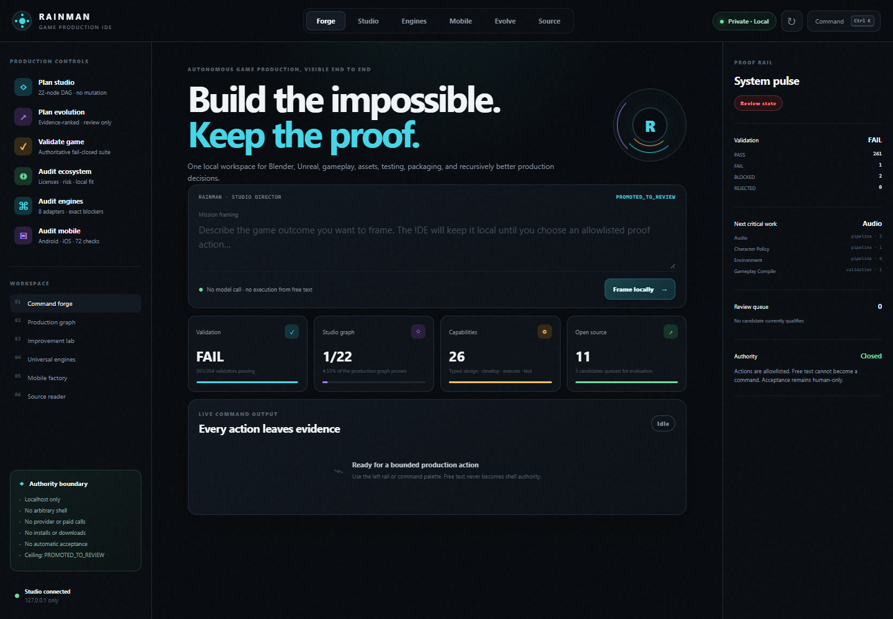
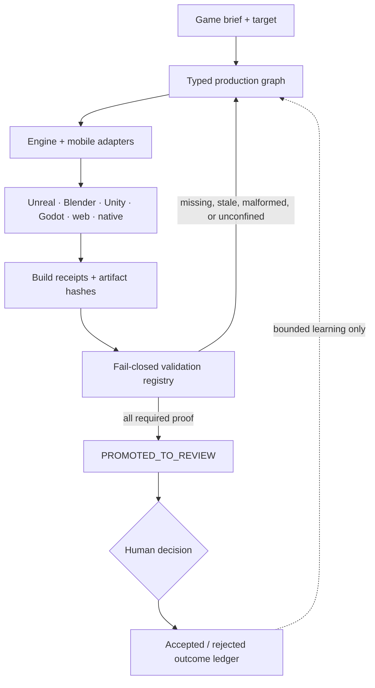
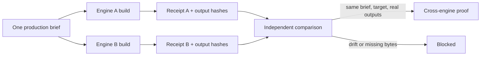
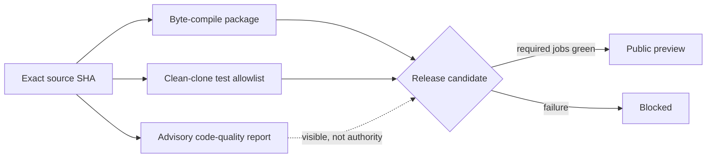

# Dimwit

<div align="center">

**A local-first, proof-bearing game-production studio.**

Plan, build, test, package, and improve across engines—then stop for human review.

[](https://github.com/ObtuseAI/dimwit/actions/workflows/tests.yml)
[](https://www.python.org/)
[](AGENTS.md)
[](LICENSE)

</div>



Dimwit coordinates game-production work across Unreal Engine, Blender, Unity, Godot, Defold, Bevy, web, CMake, Flame, and mobile toolchains. It turns a brief into a resumable production graph, binds execution to typed capabilities, collects machine-readable evidence, and refuses to turn missing proof into a pass.

The studio can autonomously reach `PROMOTED_TO_REVIEW`. Human acceptance, signing, publishing, payment, account access, and active-slice promotion remain operator-owned.

## Studio capabilities

| Surface | What it contributes |
| --- | --- |
| **Production graph** | Dependency-aware, resumable work with budgets, receipts, rollback notes, and bounded retries |
| **Universal engine adapters** | Source-controlled audit, planning, build, package, and validation contracts across major engines |
| **Blender + neural 3D** | Headless no-shell jobs, output confinement, pinned upstream revisions, patch isolation, and hashed proof |
| **Unreal production lane** | UBT/UAT, commandlets, authenticated loopback editor inspection, packaging, and process-bound capture |
| **Mobile factory** | Android/iOS input, lifecycle, performance, packaging, store-readiness, and signing-boundary plans |
| **Recursive improvement** | Diverse candidates, evidence-ranked proposals, accepted/rejected outcome accounting, and review-only promotion |
| **Rainman Studio IDE** | Local evidence, source, jobs, engines, mobile readiness, review queue, and fixed allowlisted actions |

## Production architecture



Every executable lane is expected to produce evidence. A claim without current, origin-labeled, content-addressed proof remains `BLOCKED`, `FAIL`, `REJECTED`, `NOT_RUN`, or plan-only.

## Cross-engine proof

Dimwit can compare two real build receipts bound to the same brief and target without trusting the receipts' own claims:



The verifier re-hashes declared outputs and rejects brief mismatch, duplicate engines, target mismatch, missing artifacts, LFS pointers, hash drift, or a review ceiling that exceeds `PROMOTED_TO_REVIEW`.

## Quick start

Dimwit is developed primarily on Windows. Start from an isolated Python environment:

```powershell
git clone --recurse-submodules https://github.com/ObtuseAI/dimwit.git
cd dimwit
python -m venv .venv
.\.venv\Scripts\python.exe -m pip install --upgrade pip
.\.venv\Scripts\python.exe -m pip install pytest pillow numpy trimesh
.\.venv\Scripts\python.exe scripts\apply_neural3d_patches.py
.\.venv\Scripts\python.exe -m pytest dimwit\tests -q
```

Launch the local Studio IDE:

```powershell
.\.venv\Scripts\python.exe scripts\pipeline\run_studio_ide.py --no-open --port 8765
```

The IDE prints a tokenized `127.0.0.1` URL. Keep it on loopback; the token protects source views and operator actions.

Useful entry points:

```powershell
python scripts\pipeline\run_studio.py --help
python scripts\pipeline\run_universal_game_factory.py --help
python scripts\pipeline\run_mobile_game_factory.py --help
python scripts\pipeline\run_recursive_improvement.py --help
python scripts\pipeline\run_ecosystem_audit.py
python scripts\pipeline\run_validation.py --list
```

Most execution APIs are plan-only unless the caller explicitly enables mutation.

## Engine and supply-chain boundaries

### Blender and neural 3D

Repository-owned Blender jobs use `--factory-startup`, disabled auto-exec, argv-only invocation, bounded timeouts, approved output roots, and hashed output manifests. InstantMesh and TripoSR remain pinned upstream submodules; Dimwit-specific adaptations live in `third_party/patches/` and `neural3d_extensions/`.

### Unreal Engine

The optional live-editor bridge is loopback-only and requires a random shared token of at least 32 characters. Generic dispatch exposes read-only inspection only. Mutating editor operations have dedicated gates, target windows bind to the expected process identity, and screenshots remain inside configured capture roots.

### Mobile

The mobile factory covers SDK readiness, touch/controller/keyboard behavior, safe areas, orientation, accessibility, lifecycle, thermals, memory, performance, battery, offline/network resilience, packaging, icons, screenshots, privacy, and store metadata. Signing credentials, store accounts, payment, and submission are never delegated.

## Release proof

The clean-clone GitHub workflow exercises the source-controlled Python surface without pretending that a headless Linux runner has Unreal, Blender, licensed assets, store accounts, or a human visual reviewer.



Workstation-only engine and visual checks remain separately classified. They are not replaced by synthetic evidence in CI.

## Repository map

```text
dimwit/                  core, production graphs, adapters, IDE, evolution, ledger
blender_scripts/         reviewed headless Blender jobs
ue_mcp/                  authenticated Unreal bridge and MCP forwarder
neural3d/                pinned model entry points and upstream submodules
neural3d_extensions/     Dimwit-owned adapters outside upstream checkouts
config/                  capabilities, promotion, mobile, and studio policy
scripts/                 reproducible engine, capture, QA, and maintenance tools
validators/              release and evidence checks
third_party/patches/     reviewable upstream adaptation patches
docs/                    architecture, production, and assurance notes
```

Start with:

- [Security model](SECURITY.md)
- [Contribution guide](CONTRIBUTING.md)
- [Universal game factory](docs/DIMWIT_UNIVERSAL_GAME_FACTORY_20260711.md)
- [Elite studio toolchains](docs/DIMWIT_ELITE_STUDIO_TOOLCHAINS_20260711.md)
- [Autonomy capability matrix](docs/superpowers/plans/2026-06-28-autonomy-capability-matrix.md)

## Scope and limitations

Dimwit is an experimental studio system, not a substitute for engine licenses, legal review, asset provenance review, platform certification, store acceptance, or human creative judgment. A passing clean-clone suite proves the checked source contracts only. External engines, GPU workloads, licensed content, project-specific integrations, visual quality, and distribution readiness remain explicit gates.

## License

Copyright © 2026 ObtuseAI. The source is available for evaluation, education, research, and portfolio review under the [ObtuseAI Source-Available License](LICENSE). Commercial, hosted, production, redistribution, asset, model-weight, and store-publishing rights are not granted without separate written permission.
